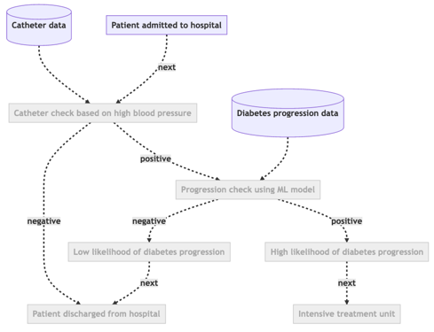
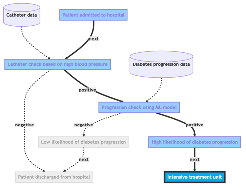
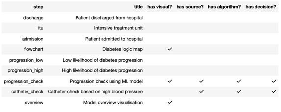
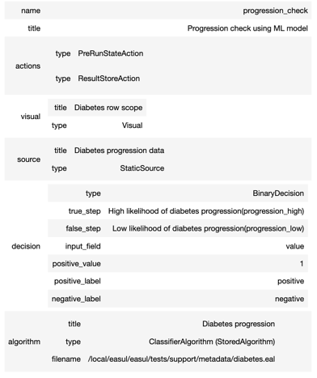

[](https://github.com/rcfgroup/easul/actions/workflows/main.yml)

# EASUL


> **Note**
> We do not recommend that 
EASUL is used in production projects in its current state.
> This documentation is still in progress and we will continue to add and update it over the coming months.

## What is EASUL? 
It is the **E**mbeddable **A**I and **S**tate-based **U**nderstandable **L**ogic toolkit. A data-driven framework targeted at clinical decision support applications. 
EASUL makes it simple and straightforward to create data-driven plans and 'drive' them or utilise them in your own tools
and systems. It has a number of features which make this easier:

* Generalisable, shareable and re-usable data-driven plans describing the data sources, steps, algorithms and states 
* Embeddable directly into Python scripts, Jupyter notebooks or as part of an engine
* Extensible to support new plan types, visual elements, data sources, step types, states, actions, algorithms 
and comparisons
* Algorithmic support for simple logic tests, to compound scores (e.g. clinical risk scores) 
or machine learning / artificial intelligence models
* human-understandable and interpretable visual elements and state-based outputs which can be embedded into other tools.
* Multi-modal data sources support include simple files and databases, but also real-time data feeds through the data broker with
in-built data processing
* Improved performance through model and prediction metadata pre-calculation
* Inbuilt data validation, conversion and encoding/decoding of input data
* Visual elements to help explain processes/workflows, models and their predictions using standard model metrics and 
* more recently created
interpretability measures (e.g. LIME)

## If I use EASUL in my research project which source should I cite?
Please cite our pre-print in arxiv which describes the framework and our evaluation of its application to 
clinical decision support in pneumonia.

## How do I install and use EASUL?
You should be able to use pip to install EASUL. You may want to do this within a Python virtual environment.
```bash
pip install easul
```

You will need to use a Jupyter notebook to run the examples as this will allow visualisations.
EASUL comes with an example plan and data sets which can be used to explore its features:

```jupyterpython
from easul.notebook import *
from easul.examples import create_example_plan

plan = create_example_plan()
visualise_plan(plan, use_external=True)
```



As you can see the plan consists of a number of steps connected together by decisions. The decisions are 
driven by data sources and algorithms. You can send some data into the plan to get the resulting
patient journey:

```jupyterpython
...
visualise_run(plan, {"catheter": {"systolic_bp": 120},
                     "progression": {"age": 59, "sex": 2, "bmi": 32.1, "bp": 101, "s1": 157, "s2": 93.2, "s3": 38,
                                     "s4": 4, "s5": 4.9, "s6": 87}
                     }, use_external=True)
```



You will now get a new version of the workflow which shows the patient journey resulting if this data is used. You
can try using different data to get different patient journeys.

You can then look at plans in more detail to determine what steps they have and whether they have specific components 
or not  (e.g. data sources, visuals, algorithms and decisions):

```jupyterpython
describe_plan(plan)
```



And with that knowledge look at an individual step in more detail to look at the components in more detail:

```jupyterpython
describe_step("progression_check", plan)
```


You can also simulate a decision obtained from a specific step and get results (and if defined, visualisations) 
by running data through a specific step.

To get the step results of the simulation:

```jupyterpython
simulate_decision("progression_check",plan, {"progression": {"age": 59, "sex": 2, "bmi": 32.1, "bp": 101, "s1": 157, "s2": 93.2, "s3": 38,
                                     "s4": 4, "s5": 4.9, "s6": 87}}, as_data=True)
```
```python
{'outcome_step': 'progression_check',
 'next_step': 'progression_high',
 'reason': 'positive',
 'result': {'value': 1,
  'label': 'Progression',
  'probabilities': [{'probability': 0.2,
    'label': 'No progression',
    'value': 0},
   {'probability': 0.8, 'label': 'Progression', 'value': 1}],
  'data': {'age': 60.0,
   'sex': 2,
   'bmi': 32.1,
   'bp': 101.0,
   's1': 157.0,
   's2': 93.2,
   's3': 38.0,
   's4': 4.0,
   's5': 4.9,
   's6': 87.0}}}
```

## Advanced usage
Processing multiple data points is a little more involved because it requires an engine to be utilised in order to
drive the journeys. 

Before setting up the engine, it is necessary to define data sources which will provide the basis for the patient journeys
and inject these into the plan.
                                                                                                                          
'processes' provide the ability to do some transformations on the data prior to their use in their respective steps. 
Processes are simple callable classes or functions - which operate on input data and return transformed data.
EASUL comes with a bank of commonly used processes, but custom functions can be easily used.

Since the engine operates over a time period, it is necessary to provide the start and end times for each patient 
journey. 

The use of processes simplifies the construction of new timestamp fields combining date and time strings with 
different formats.

```jupyterpython
from easul import *
from easul.examples import load_data_file
admissions = DataFrameSource(title="Admissions",
                           data=load_data_file("admission.csv", limit=10),
                           processes=[
                               ParseDate(field_name="date_of_birth", format="%Y%m%d"),
                               ParseDate(field_name="admission_date", format="%Y-%m-%d"),
                               ParseTime(field_name="admission_time", format="%H:%M:%S"),
                               ParseDate(field_name="discharge_date", format="%Y-%m-%d"),
                               ParseTime(field_name="discharge_time", format="%H:%M"),
                               CombineDateTime(date_field="admission_date", time_field="admission_time",
                                               output_field="admission_ts"),
                               CombineDateTime(date_field="discharge_date", time_field="discharge_time",
                                               output_field="discharge_ts")
                           ],
                           reference_field="admission_id",
                           )
```

Now we can setup the other sources required.
```jupyterpython
    catheter = DataFrameSource(title="Catheter",
                               data=load_data_file("catheter.csv"),
                               reference_field="admission_id",
                               )

    progression = CollatedSource(
        sources={"admissions": admissions, "progression": DataFrameSource(title="Progression",
                                                                    data=load_data_file("progression.csv"),
                                                                    reference_field="admission_id"
                                                                    )},
        processes=[
            Age(from_field="date_of_birth", to_field="admission_date", target_field="age"),
            MapValues(mappings={"M": 1, "F": 2}, field="sex")
        ],
        title="Progression",
    )
```

The 'progression' source re-uses the 'admissions' source and combines it with another data file through the CollatedSource.
It also shows how processes can be used to create derived data e.g. age and sex as numbers rather than characters.
This data format is required in order for the diabetes progression machine learning model to operate correctly.

A 'reference_name' corresponding to one of the sources is required to drive the engine. This provides the list of 
references and the fields containing start and end timestamps.

```jupyterpython
from easul.engine.local import LocalEngine
plan = create_example_plan() #same plan from above

engine = LocalEngine(
        sources={"admissions": admissions, "catheter": catheter, "progression": progression},
        reference_name="admissions",
        start_ts_field="admission_ts",
        end_ts_field="discharge_ts",
    )

    
    engine.run(plan)
    states, steps = engine.get_outcomes()

```

The outputs from this are two lists containing states and steps for each patient admission in the 'admissions' 
source which can be subsequently analysed.

## Is EASUL being actively maintained?
Yes, we are using EASUL as the basis for research grants and current projects and are actively maintaining and 
developing it with new features. However, it is still work in progress and therefore we do not recommend that 
it is used in production projects in its current state.

## What license is EASUL released under?
The core EASUL library has been released under an LGPL License (Version 3.0) so it can be integrated into other tools
and modified in accordance with the permissions stated (see https://www.gnu.org/licenses/lgpl-3.0.html or [LICENSE.md](LICENSE.md) for more details).

## Third-party tools
EASUL uses MermaidJS (https://mermaid.js.org/) to draw your workflow diagrams.
To simplify the setup, this tutorial embeds the JS download from a CDN into HTML, but the default is to use a local version
installed from NPM via NodeJS.

We recommend that for instances where data is sensitive that you install and use the MermaidJS CLI using NPM.

## Logo design
The EASUL logo is based on an altered version of this [image](https://www.pngall.com/canvas-easel-png/download/57387)
which is licensed under a [Creative Commons 4.0 BY-NC license.](https://creativecommons.org/licenses/by-nc/4.0/)
It incorporates public domain clipart available from https://publicdomainvectors.org/en/free-clipart.


